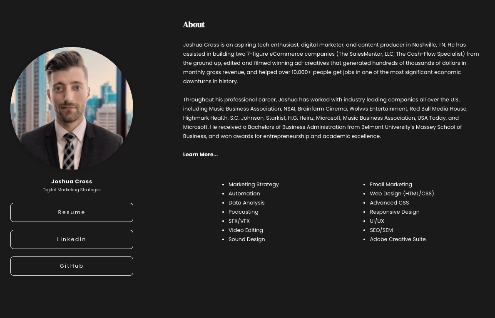

# Joshua Cross Portfolio

## Description

The following portfolio was created with HTML and Advanced CSS declarations and attributes to create a fully-responsive, mobile-friendly, search optimized, and assessible design.

The UX allows the navigation to be simplistic, directing one to sections of the webpage, and the brand is unified by a modern design featuring corresponding links, forms, and button designs.

On this page, one will find a summarized overview of Joshua's work, including links to his resume, linked in and GitHub. 

Moreover, the use of flexboxes throughout, develop an adaptable mobile responsive design allowing this page to be viewed on various screens. 

## Website
https://joshacross.github.io/portfolio

### Referenced Images
